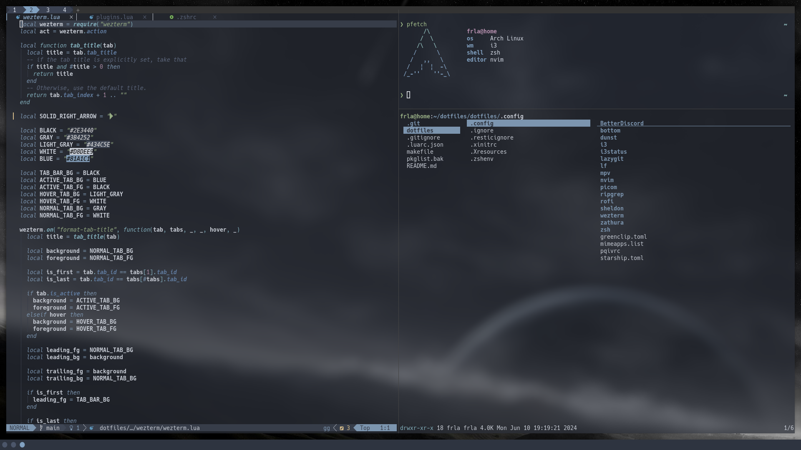

# dotfiles

Personal dotfiles for an Arch Linux desktop.



## Overview

This repository manages configuration with a simple `home/` source tree and a
`makefile` that installs packages and links files into `$HOME`.

The `home/` directory is not the real home directory. It is the source tree
that mirrors the structure under `$HOME`, for example:

- `home/.config/nvim` -> `~/.config/nvim`
- `home/.zshenv` -> `~/.zshenv`
- `home/.resticignore` -> `~/.resticignore`

## Main Components

- os: arch linux
- wm: i3-wm
  - bar: i3blocks
- terminal: wezterm
- shell: zsh
  - plugin manager: sheldon
  - prompt: starship
- editor: neovim with lazyvim
- launcher: rofi
- file manager: yazi
- image viewer: imv
- video player: mpv

## Repository Layout

- `home/`: files that are linked into the real home directory
- `makefile`: package installation and symlink bootstrap
- `misc/`: screenshots and helper assets
- `.git-crypt/`: encrypted file support

Most application settings live under `home/.config/<app>/`. This keeps each
application self-contained while still using one top-level source tree.

## Setup

Typical bootstrap flow:

```sh
make yay
make install
```

Useful targets:

- `make help`: list available targets
- `make unlock`: unlock encrypted files with `git-crypt`

## Encrypted Files

Some files are stored with `git-crypt`. In particular, credentials-like data
such as `home/.config/rclone/rclone.conf` is encrypted in the repository.

Run `make unlock` before using encrypted configuration files.
